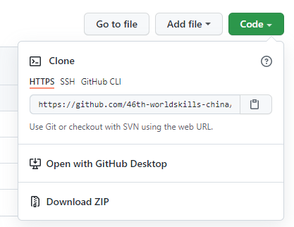
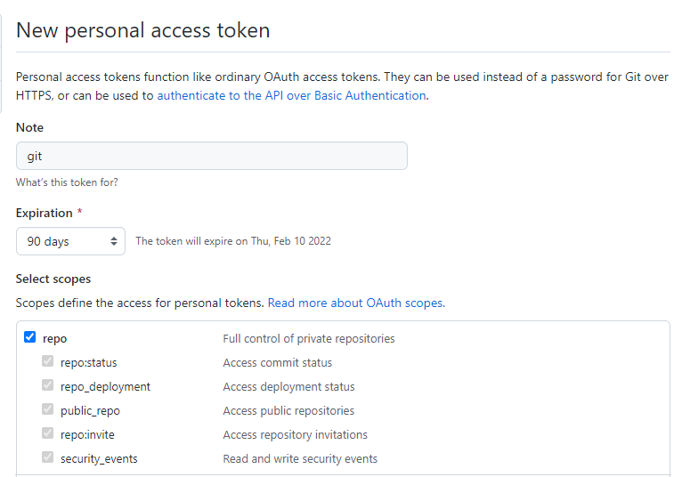
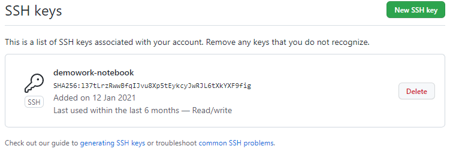
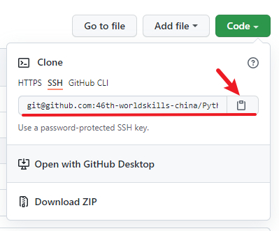
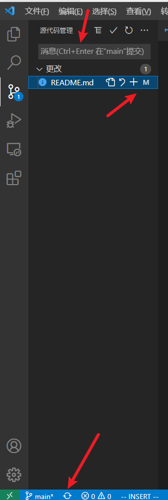
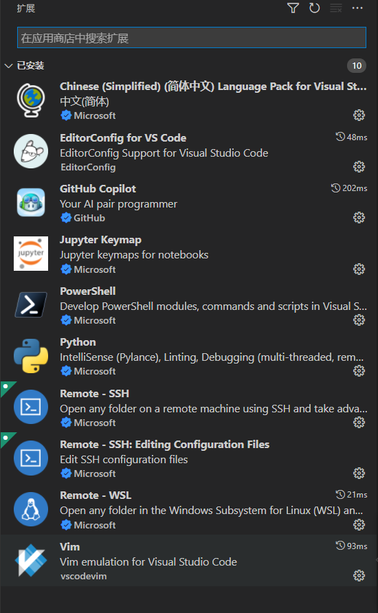

# GitHub使用

## 设置本地git用户

```bash
demo@LAPTOP-88IT1KKT:~$ git config --global user.name "hdaojin"
demo@LAPTOP-88IT1KKT:~$ git config --global user.email "hdaojin@hotmail.com"
demo@LAPTOP-88IT1KKT:~$ git config --list
```



GitHub clone远端仓库的三种方式：
1. HTTPS
2. SSH
3. GitHub CLI

使用 HTTPS url 克隆对初学者来说会比较方便，复制HTTPS url 然后到 git Bash 里面直接用 clone 命令克隆到本地就好了，但是每次 fetch 和 push 代码都需要输入账号和密码，这也是HTTPS 方式的麻烦之处。而使用 SSH url 克隆却需要在克隆之前先配置和添加好SSH key，因此，如果你想要使用SSH url克隆的话，你必须是这个项目的拥有者或管理员。否则你是无法添加 SSH key 的，另外 SSH 默认是每次 fetch 和 push 代码都不需要输入账号和密码（可设置）。

> 注：目前github已经不支持用户使用密码进行git的操作，而必须要使用tokens

## 配置使用https进行git操作

### 创建Personal access tokens

Settings > Developer settings > Personal access tokens



> 记录好生成的token，忘了就要重新生成。

### 为https连接设置代理(如有需要)

```bash
 git config --global http.https://github.com.proxy socks5://172.25.144.1:7890
 git config --global https.https://github.com.proxy socks5://172.25.144.1:7890
```

### 使用https方式clone远端仓库到本地

```bash
git clone https://github.com/hdaojin/Python-Examples.git
```

## 配置使用ssh密钥对认证

### 创建密钥对

打开git-bash，执行：

```bash
$ ssh-keygen -t ed25519 -C "hdaojin@hotmail.com"
$ ls
id_ed25519  id_ed25519.pub
```

旧的系统

```bash
$ ssh-keygen.exe -C "hdaojin@hotmail.com"

$ ls .ssh
id_rsa  id_rsa.pub

```

### 启用ssh代理

如果使用多个私钥或者使用了私钥密码，建议使用ssh-agent

```bash
$ eval "$(ssh-agent -s)"
$ ssh-add .ssh/id_rsa
```

登录生效的方法：[参考][2]

#### 方式1： 脚本

```bash
# bashrc
if ! pgrep -u "$USER" ssh-agent > /dev/null; then
    ssh-agent -t 1h > "$XDG_RUNTIME_DIR/ssh-agent.env"
fi
if [[ ! "$SSH_AUTH_SOCK" ]]; then
    source "$XDG_RUNTIME_DIR/ssh-agent.env" >/dev/null
fi

# .ssh/config
AddKeysToAgent yes
```

#### 方式2: 安装keychain

```bash
# .bashrc
eval $(keychain --eval --quiet ~/.ssh/id_ed25519)
```

### 复制id_rsa.pub的内容到github

```bash
$ clip < ~/.ssh/id_rsa.pub
```
该命令会将id_rsa.pub的内容复制到剪贴板。

登录你的`github`账号，从右上角的设置（`Settings`）进入，然后点击菜单栏的 `SSH and GPG keys `进入页面添加 `SSH key`。



### 为ssh设置代理(如需要) [Proxy设置参考][1]

```bash
# $ sudo vim /etc/ssh/ssh_config.d/git.conf
[vctadmin@vct-devel ~]$ cat .ssh/config
Host github.com
        User demo
        Hostname github.com
        Port 22
#        AddKeysToAgent yes
        ProxyCommand ncat --proxy 192.168.238.1:7890  --proxy-type socks5  %h %p
        IdentityFile .ssh/id_ed25519
# 不用ssh-agent的话，直接在配置文件中指定key最简单直接
```

### 测试ssh key是否配置成功

```shell-session
$ ssh -T git@github.com
Hi hdaojin! You've successfully authenticated, but GitHub does not provide shell access.
```


### 使用ssh方式clone远端仓库到本地



在Windows下可以在文件浏览器中先去到你存放本地仓库的目录，然后右击，选择`Git Bash Here`。

```bash
$ git clone git@github.com:46th-worldskills-china/Python-Learning.git
Cloning into 'Python-Learning'...
remote: Enumerating objects: 22, done.
remote: Counting objects: 100% (22/22), done.
remote: Compressing objects: 100% (20/20), done.
remote: Total 22 (delta 2), reused 14 (delta 1), pack-reused 0
Receiving objects: 100% (22/22), 404.83 KiB | 299.00 KiB/s, done.
Resolving deltas: 100% (2/2), done.
```

接下来，可以使用其他git bash命令来操作本地仓库或同步远程仓库了。

## VSC操作github仓库

用VSC打开本地仓库所在的文件夹`Python-Learning`, 在源代码管理中可进行暂存、提交、推送/拉取的操作。



**VSC推荐的扩展**




## 参考文档

[分布式 Git - 分布式工作流程](https://git-scm.com/book/zh/v2/%E5%88%86%E5%B8%83%E5%BC%8F-Git-%E5%88%86%E5%B8%83%E5%BC%8F%E5%B7%A5%E4%BD%9C%E6%B5%81%E7%A8%8B)


[使用 Git 和 GitHub 进行协同开发流程](https://toutiao.io/posts/sn5u4/preview)


[1]: https://blog.systemctl.top/2017/2017-09-28_set-proxy-for-git-and-ssh-with-socks5/
[2]: https://wiki.archlinux.org/title/SSH_keys_(%E7%AE%80%E4%BD%93%E4%B8%AD%E6%96%87)#RSA